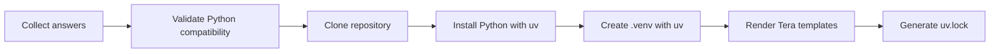

# `odk create`

`odk create` is an interactive project generator for Odoo development repositories.

```bash
odk create
```

## Interactive Flow

The generator asks for the values that shape the project:

1. Project Name
2. Project Path
3. Git Repository
4. Odoo Source Code Path
5. Odoo Version
6. Python Version
7. PostgreSQL Version
8. Use Docker
9. Generate PyCharm
10. Generate VS Code

```text
Odoo Project Creator

Project Name:
> geaai_odoo

Project Path:
  geaai_odoo (default)
> /Users/agga/Documents/python-dev/odoo-dev

Git Repository:
> git@github.com:company/template.git

Odoo Source Code Path:
> /Users/agga/src/odoo

Odoo Version:
  19.0
  18.0
  17.0
> 19.0

Python Version:
  3.10
  3.12
  3.11
  3.13
> 3.10
```

`Project Path` accepts the parent directory. For the values above, the generated
project directory is `/Users/agga/Documents/python-dev/odoo-dev/geaai_odoo`.
Entering a complete path that already ends with the project name is also supported.

## Workflow

ODK performs the setup in a deterministic order:



The environment is always created with `uv`:

```bash
uv python install <version>
uv venv .venv --python <version>
```

!!! warning "No `python -m venv`"
    ODK deliberately avoids `python -m venv` so teams get one consistent Python environment workflow.

## Compatibility Matrix

| Odoo Version | Supported Python Versions |
| --- | --- |
| 19.0 | 3.12, 3.13 |
| 18.0 | 3.11, 3.12 |
| 17.0 | 3.11 |

Invalid combinations fail before cloning or generating files.

## Generated Project Structure

```text
project/
├── .venv/
├── addons/
├── custom/
├── docker/
├── scripts/
├── .idea/
├── .vscode/
├── compose.yaml
├── Dockerfile
├── odoo.conf
├── .gitignore
├── README.md
├── pyproject.toml
└── uv.lock
```

## Template Variables

Every generated file is rendered with Tera. Templates receive:

| Variable | Description |
| --- | --- |
| `project_name` | Project directory and package name |
| `odoo_version` | Selected Odoo version |
| `python_version` | Selected Python version |
| `postgres_version` | Selected PostgreSQL version |
| `database_name` | PostgreSQL-safe database name derived from the project name |

## Editor Configuration

When selected, ODK generates editor configuration that points to `.venv`.

=== "PyCharm"

    ```text
    Script: <Odoo Source Code Path>/odoo-bin
    Arguments: -c $PROJECT_DIR$/odoo.conf
    Interpreter: uv (<Project Name>)
    ```

=== "VS Code"

    ```json
    {
      "python.defaultInterpreterPath": "${workspaceFolder}/.venv/bin/python"
    }
    ```
